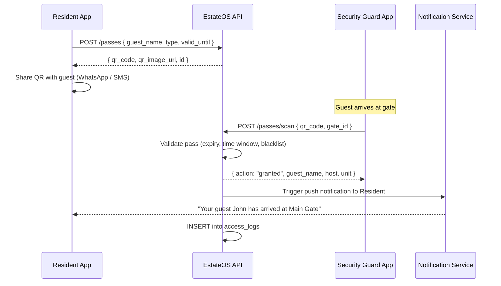
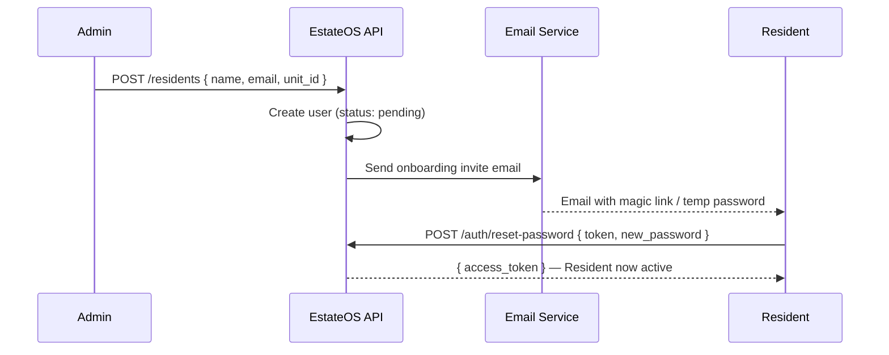
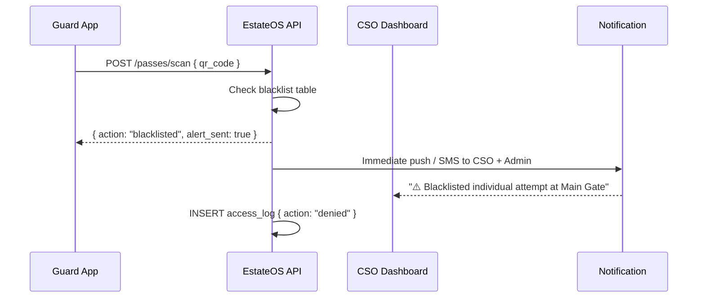

# EstateOS — API & Database Reference

> Version: 1.0 · Security Module MVP  
> Stack: NestJS (REST) · PostgreSQL · JWT Auth  
> Base URL: `https://api.estateos.io/v1`

---

## Table of Contents

1. [Authentication](#authentication)
2. [Database Schema](#database-schema)
3. [API Endpoints — Auth](#auth-endpoints)
4. [API Endpoints — Guest / Visitor Management](#visitor-endpoints)
5. [API Endpoints — Residents](#resident-endpoints)
6. [API Endpoints — Incidents](#incident-endpoints)
7. [API Endpoints — Payments](#payment-endpoints)
8. [Key Flow Diagrams](#flow-diagrams)
9. [RBAC Roles & Permissions](#rbac)
10. [Security Notes](#security)

---

## 1. Authentication

EstateOS uses **JWT Bearer tokens** with role-based claims.

```
Authorization: Bearer <jwt_token>
```

**JWT Payload:**
```json
{
  "sub": "usr_abc123",
  "email": "admin@estateos.io",
  "role": "admin",
  "estate_id": "est_xyz456",
  "iat": 1700000000,
  "exp": 1700086400
}
```

**Roles:** `admin` · `security` · `resident`

---

## 2. Database Schema

### `tenants` (Estates)
```sql
CREATE TABLE tenants (
  id           UUID PRIMARY KEY DEFAULT gen_random_uuid(),
  name         VARCHAR(120) NOT NULL,
  slug         VARCHAR(80) UNIQUE NOT NULL,         -- e.g. "lekki-phase-1"
  region       VARCHAR(60),
  tier         VARCHAR(20) DEFAULT 'standard',      -- standard | premium | enterprise
  modules      TEXT[] DEFAULT '{"security"}',       -- active modules
  unit_count   INTEGER DEFAULT 0,
  created_at   TIMESTAMPTZ DEFAULT NOW(),
  updated_at   TIMESTAMPTZ DEFAULT NOW()
);
```

### `users`
```sql
CREATE TABLE users (
  id             UUID PRIMARY KEY DEFAULT gen_random_uuid(),
  estate_id      UUID NOT NULL REFERENCES tenants(id) ON DELETE CASCADE,
  full_name      VARCHAR(120) NOT NULL,
  email          VARCHAR(255) UNIQUE NOT NULL,
  phone          VARCHAR(20),
  password_hash  TEXT NOT NULL,
  role           VARCHAR(20) NOT NULL CHECK (role IN ('admin', 'security', 'resident')),
  status         VARCHAR(20) DEFAULT 'active' CHECK (status IN ('active', 'inactive', 'suspended')),
  avatar_url     TEXT,
  created_at     TIMESTAMPTZ DEFAULT NOW(),
  updated_at     TIMESTAMPTZ DEFAULT NOW()
);

CREATE INDEX idx_users_estate ON users(estate_id);
CREATE INDEX idx_users_email ON users(email);
```

### `units`
```sql
CREATE TABLE units (
  id            UUID PRIMARY KEY DEFAULT gen_random_uuid(),
  estate_id     UUID NOT NULL REFERENCES tenants(id) ON DELETE CASCADE,
  unit_number   VARCHAR(20) NOT NULL,               -- e.g. "A-01"
  block         VARCHAR(10),                        -- e.g. "A"
  floor         INTEGER DEFAULT 0,
  type          VARCHAR(20) DEFAULT 'apartment',    -- apartment | villa | townhouse
  status        VARCHAR(20) DEFAULT 'occupied',     -- occupied | vacant | maintenance
  created_at    TIMESTAMPTZ DEFAULT NOW(),
  UNIQUE(estate_id, unit_number)
);
```

### `residents`
```sql
CREATE TABLE residents (
  id            UUID PRIMARY KEY DEFAULT gen_random_uuid(),
  user_id       UUID NOT NULL REFERENCES users(id) ON DELETE CASCADE,
  estate_id     UUID NOT NULL REFERENCES tenants(id) ON DELETE CASCADE,
  unit_id       UUID NOT NULL REFERENCES units(id),
  resident_type VARCHAR(20) DEFAULT 'tenant' CHECK (resident_type IN ('owner', 'tenant')),
  move_in_date  DATE,
  move_out_date DATE,
  is_active     BOOLEAN DEFAULT TRUE,
  created_at    TIMESTAMPTZ DEFAULT NOW()
);
```

### `guest_passes`
```sql
CREATE TABLE guest_passes (
  id            UUID PRIMARY KEY DEFAULT gen_random_uuid(),
  estate_id     UUID NOT NULL REFERENCES tenants(id) ON DELETE CASCADE,
  resident_id   UUID NOT NULL REFERENCES residents(id) ON DELETE CASCADE,
  guest_name    VARCHAR(120) NOT NULL,
  guest_phone   VARCHAR(20),
  pass_type     VARCHAR(20) NOT NULL CHECK (pass_type IN ('single', 'service', 'permanent')),
  qr_code       TEXT UNIQUE NOT NULL,               -- encrypted QR token
  qr_image_url  TEXT,                               -- pre-generated QR image
  valid_from    TIMESTAMPTZ NOT NULL DEFAULT NOW(),
  valid_until   TIMESTAMPTZ,                        -- NULL for permanent
  time_start    TIME,                               -- for service passes (e.g. 09:00)
  time_end      TIME,                               -- for service passes (e.g. 17:00)
  status        VARCHAR(20) DEFAULT 'active' CHECK (status IN ('active', 'used', 'revoked', 'expired')),
  notes         TEXT,
  created_at    TIMESTAMPTZ DEFAULT NOW(),
  updated_at    TIMESTAMPTZ DEFAULT NOW()
);

CREATE INDEX idx_passes_estate ON guest_passes(estate_id);
CREATE INDEX idx_passes_qr ON guest_passes(qr_code);
CREATE INDEX idx_passes_status ON guest_passes(status);
```

### `gates`
```sql
CREATE TABLE gates (
  id          UUID PRIMARY KEY DEFAULT gen_random_uuid(),
  estate_id   UUID NOT NULL REFERENCES tenants(id) ON DELETE CASCADE,
  name        VARCHAR(80) NOT NULL,                 -- e.g. "Main Gate"
  location    VARCHAR(120),
  is_active   BOOLEAN DEFAULT TRUE,
  created_at  TIMESTAMPTZ DEFAULT NOW()
);
```

### `access_logs`
```sql
CREATE TABLE access_logs (
  id              UUID PRIMARY KEY DEFAULT gen_random_uuid(),
  estate_id       UUID NOT NULL REFERENCES tenants(id),
  gate_id         UUID NOT NULL REFERENCES gates(id),
  pass_id         UUID REFERENCES guest_passes(id),
  guard_id        UUID REFERENCES users(id),
  guest_name      VARCHAR(120),
  entry_type      VARCHAR(20) DEFAULT 'qr' CHECK (entry_type IN ('qr', 'manual', 'anpr')),
  action          VARCHAR(20) NOT NULL CHECK (action IN ('granted', 'denied', 'flagged')),
  denied_reason   TEXT,
  vehicle_plate   VARCHAR(30),
  image_url       TEXT,                             -- snapshot from CCTV or guard upload
  entry_at        TIMESTAMPTZ DEFAULT NOW(),
  exit_at         TIMESTAMPTZ,
  notes           TEXT
);

CREATE INDEX idx_logs_estate_date ON access_logs(estate_id, entry_at DESC);
CREATE INDEX idx_logs_gate ON access_logs(gate_id);
```

### `incidents`
```sql
CREATE TABLE incidents (
  id            UUID PRIMARY KEY DEFAULT gen_random_uuid(),
  estate_id     UUID NOT NULL REFERENCES tenants(id),
  reporter_id   UUID NOT NULL REFERENCES users(id),
  gate_id       UUID REFERENCES gates(id),
  title         VARCHAR(180) NOT NULL,
  description   TEXT,
  severity      VARCHAR(20) DEFAULT 'pending' CHECK (severity IN ('pending', 'flagged', 'critical')),
  status        VARCHAR(20) DEFAULT 'open' CHECK (status IN ('open', 'reviewing', 'resolved', 'escalated')),
  image_url     TEXT,
  voice_note_url TEXT,
  action_taken  TEXT,
  resolved_at   TIMESTAMPTZ,
  resolved_by   UUID REFERENCES users(id),
  created_at    TIMESTAMPTZ DEFAULT NOW(),
  updated_at    TIMESTAMPTZ DEFAULT NOW()
);
```

### `payments`
```sql
CREATE TABLE payments (
  id              UUID PRIMARY KEY DEFAULT gen_random_uuid(),
  estate_id       UUID NOT NULL REFERENCES tenants(id),
  resident_id     UUID NOT NULL REFERENCES residents(id),
  payment_type    VARCHAR(40) NOT NULL,             -- "Service Charge" | "Rent" | "Annual Levy"
  amount          BIGINT NOT NULL,                  -- stored in kobo/cents
  currency        CHAR(3) DEFAULT 'NGN',
  due_date        DATE NOT NULL,
  paid_at         TIMESTAMPTZ,
  payment_ref     VARCHAR(80),                      -- payment gateway reference
  status          VARCHAR(20) DEFAULT 'pending' CHECK (status IN ('pending', 'paid', 'overdue', 'waived')),
  notes           TEXT,
  created_at      TIMESTAMPTZ DEFAULT NOW()
);

CREATE INDEX idx_payments_estate ON payments(estate_id);
CREATE INDEX idx_payments_status ON payments(status);
```

### `blacklist`
```sql
CREATE TABLE blacklist (
  id          UUID PRIMARY KEY DEFAULT gen_random_uuid(),
  estate_id   UUID NOT NULL REFERENCES tenants(id),
  added_by    UUID NOT NULL REFERENCES users(id),
  name        VARCHAR(120),
  id_number   VARCHAR(60),                          -- national ID / passport
  vehicle_plate VARCHAR(30),
  reason      TEXT NOT NULL,
  image_url   TEXT,
  is_active   BOOLEAN DEFAULT TRUE,
  created_at  TIMESTAMPTZ DEFAULT NOW()
);
```

---

## 3. Auth Endpoints

| Method | Endpoint | Auth | Description |
|--------|----------|------|-------------|
| `POST` | `/auth/login` | ❌ | Sign in (email + password) |
| `POST` | `/auth/refresh` | ❌ | Refresh access token |
| `POST` | `/auth/logout` | ✅ | Invalidate current token |
| `POST` | `/auth/forgot-password` | ❌ | Send reset email |
| `POST` | `/auth/reset-password` | ❌ | Reset with token |
| `GET` | `/auth/me` | ✅ | Get current user profile |

### POST `/auth/login`
**Request:**
```json
{
  "email": "admin@estateos.io",
  "password": "securePassword123",
  "estate_slug": "lekki-phase-1"
}
```
**Response `200`:**
```json
{
  "access_token": "eyJhbGc...",
  "refresh_token": "eyJhbGc...",
  "expires_in": 86400,
  "user": {
    "id": "usr_abc123",
    "full_name": "Adaeze Okafor",
    "email": "admin@estateos.io",
    "role": "admin",
    "estate_id": "est_xyz456"
  }
}
```

---

## 4. Visitor / Guest Pass Endpoints

| Method | Endpoint | Auth | Role | Description |
|--------|----------|------|------|-------------|
| `POST` | `/passes` | ✅ | resident | Create guest pass |
| `GET` | `/passes` | ✅ | resident | List my passes |
| `GET` | `/passes/:id` | ✅ | resident, security | Get pass details |
| `DELETE` | `/passes/:id` | ✅ | resident | Revoke a pass |
| `POST` | `/passes/scan` | ✅ | security | Scan + validate QR |
| `GET` | `/access-logs` | ✅ | admin, security | List access events |
| `GET` | `/access-logs/:id` | ✅ | admin | Get single log |
| `POST` | `/access-logs/manual` | ✅ | security | Manual entry log |

### POST `/passes` — Create Guest Pass
**Request:**
```json
{
  "guest_name": "Kelechi Nwosu",
  "guest_phone": "+2348012345678",
  "pass_type": "single",
  "valid_from": "2026-03-17T00:00:00Z",
  "valid_until": "2026-03-17T23:59:59Z",
  "notes": "Here to fix the AC"
}
```
**Service pass** also includes: `"time_start": "09:00"`, `"time_end": "17:00"`

**Response `201`:**
```json
{
  "id": "gpa-001",
  "qr_code": "ESTATEOS_PASS_eyJpZCI6...",
  "qr_image_url": "https://cdn.estateos.io/qr/gpa-001.png",
  "status": "active",
  "pass_type": "single",
  "guest_name": "Kelechi Nwosu",
  "valid_until": "2026-03-17T23:59:59Z"
}
```

### POST `/passes/scan` — Verify QR at Gate
**Request:**
```json
{
  "qr_code": "ESTATEOS_PASS_eyJpZCI6...",
  "gate_id": "gate-001",
  "guard_id": "usr-guard-001",
  "vehicle_plate": "LSD 234 XZ"
}
```
**Response `200`:**
```json
{
  "action": "granted",
  "guest_name": "Kelechi Nwosu",
  "host": "Adaeze Okafor",
  "unit": "A-01",
  "pass_type": "single",
  "message": "Access granted. Entry logged.",
  "log_id": "log-789"
}
```
**Response `403` (denied):**
```json
{
  "action": "denied",
  "reason": "Pass expired",
  "message": "Access denied. Resident notified."
}
```
**Response `403` (blacklisted):**
```json
{
  "action": "blacklisted",
  "reason": "Individual on estate blacklist",
  "alert_sent": true,
  "message": "CSO has been alerted immediately."
}
```

---

## 5. Resident Endpoints

| Method | Endpoint | Auth | Role | Description |
|--------|----------|------|------|-------------|
| `GET` | `/residents` | ✅ | admin | List all residents |
| `POST` | `/residents` | ✅ | admin | Create resident account |
| `GET` | `/residents/:id` | ✅ | admin, resident | Get resident profile |
| `PATCH` | `/residents/:id` | ✅ | admin | Update resident |
| `DELETE` | `/residents/:id` | ✅ | admin | Deactivate resident |
| `GET` | `/residents/:id/passes` | ✅ | admin, resident | Resident's guest passes |
| `POST` | `/residents/invite` | ✅ | admin | Send onboarding invite |

### POST `/residents` — Create Resident
**Request:**
```json
{
  "full_name": "Chukwuemeka Eze",
  "email": "emeka@mail.com",
  "phone": "+2348023456789",
  "unit_id": "unit-a-14",
  "resident_type": "tenant",
  "move_in_date": "2024-03-01"
}
```
**Response `201`:** Full resident object including `user_id` and invite link.

---

## 6. Incident Endpoints

| Method | Endpoint | Auth | Role | Description |
|--------|----------|------|------|-------------|
| `GET` | `/incidents` | ✅ | admin, security | List incidents |
| `POST` | `/incidents` | ✅ | security, resident | Log new incident |
| `GET` | `/incidents/:id` | ✅ | admin, security | Get incident details |
| `PATCH` | `/incidents/:id/status` | ✅ | admin | Update status |
| `POST` | `/incidents/:id/escalate` | ✅ | admin | Escalate to CSO |

### POST `/incidents` — Log Incident
**Request:**
```json
{
  "title": "Suspicious Vehicle – South Gate",
  "description": "Dark Toyota Hilux parked outside for 30+ mins. Plate: LSD-345-XZ.",
  "gate_id": "gate-south-001",
  "severity": "flagged",
  "image_url": "https://cdn.estateos.io/incidents/img_abc.jpg"
}
```
**Response `201`:** Created incident object with `id`, `status: "open"`, `created_at`.

### PATCH `/incidents/:id/status`
```json
{
  "status": "resolved",
  "action_taken": "Police notified. Suspect left the area."
}
```

---

## 7. Payment Endpoints

| Method | Endpoint | Auth | Role | Description |
|--------|----------|------|------|-------------|
| `GET` | `/payments` | ✅ | admin | List all payments |
| `GET` | `/payments/summary` | ✅ | admin | MTD totals |
| `POST` | `/payments` | ✅ | admin | Create payment record |
| `PATCH` | `/payments/:id` | ✅ | admin | Mark as paid |
| `POST` | `/payments/:id/remind` | ✅ | admin | Send reminder notification |
| `GET` | `/residents/:id/payments` | ✅ | admin, resident | Resident payment history |

### GET `/payments/summary`
**Response:**
```json
{
  "period": "2026-03",
  "total_collected": 480000000,
  "total_pending": 63000000,
  "overdue_count": 1,
  "currency": "NGN"
}
```
> Amounts are in **kobo** (×100 for NGN). Divide by 100 for display.

---

## 8. Flow Diagrams

### 8.1 Visitor Entry Flow


### 8.2 Resident Onboarding Flow


### 8.3 Blacklist Alert Flow


---

## 9. RBAC Roles & Permissions

| Resource | Admin | Security | Resident |
|----------|:-----:|:--------:|:--------:|
| View all residents | ✅ | ❌ | ❌ |
| Create/edit residents | ✅ | ❌ | ❌ |
| View all visitor logs | ✅ | ✅ | ❌ |
| View own visitor logs | ✅ | ✅ | ✅ |
| Create guest passes | ✅ | ❌ | ✅ |
| Scan QR at gate | ❌ | ✅ | ❌ |
| Log incidents | ✅ | ✅ | ✅ |
| Resolve incidents | ✅ | ❌ | ❌ |
| View payments | ✅ | ❌ | own only |
| Manage payments | ✅ | ❌ | ❌ |
| Manage blacklist | ✅ | ❌ | ❌ |
| View gate status | ✅ | ✅ | ❌ |

---

## 10. Security Notes

### Encryption
- **Passwords**: Bcrypt with cost factor 12
- **QR tokens**: HMAC-SHA256 signed, base64url encoded, include `exp` + `estate_id`
- **Data at rest**: AES-256 via PostgreSQL transparent data encryption (TDE) or AWS RDS encryption
- **Transit**: TLS 1.3 mandatory on all endpoints

### QR Token Structure
```
ESTATEOS_PASS_{base64url(JSON payload)}.{HMAC signature}

Payload: {
  "id": "gpa-001",
  "estate_id": "est_xyz456",
  "type": "single",
  "exp": 1710720000
}
```

### Rate Limiting
| Endpoint | Limit |
|----------|-------|
| `POST /auth/login` | 10 req/min per IP |
| `POST /passes/scan` | 120 req/min per gate device |
| `POST /incidents` | 20 req/min per user |
| All other endpoints | 60 req/min per user |

### Audit Logging
Every **write** operation appends an audit entry:
```sql
CREATE TABLE audit_logs (
  id          UUID PRIMARY KEY DEFAULT gen_random_uuid(),
  estate_id   UUID NOT NULL,
  user_id     UUID,
  action      VARCHAR(80) NOT NULL,      -- e.g. "pass.created", "incident.resolved"
  resource    VARCHAR(40),               -- "guest_passes", "incidents"
  resource_id UUID,
  payload     JSONB,
  ip_address  INET,
  created_at  TIMESTAMPTZ DEFAULT NOW()
);
```

### Data Retention
- Visitor ID scans: Auto-purged after **30 days** (GDPR / data privacy)
- Access logs: Retained **90 days** then archived
- Incident records: Retained **1 year**
- Audit logs: Retained **2 years**

---

*EstateOS API Reference v1.0 — Last updated March 2026*  
*For backend implementation queries, refer to the NestJS module structure in the backend repo.*
